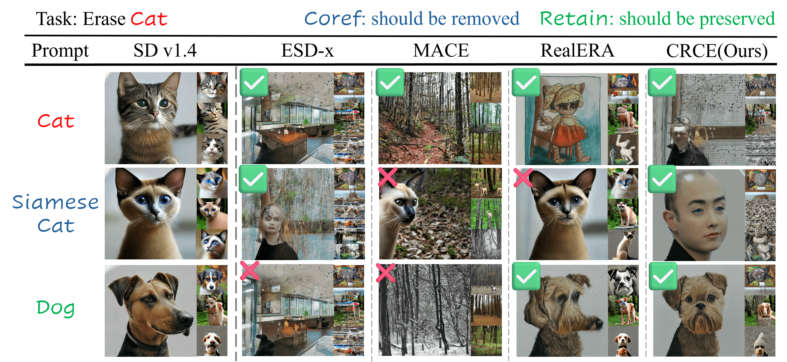
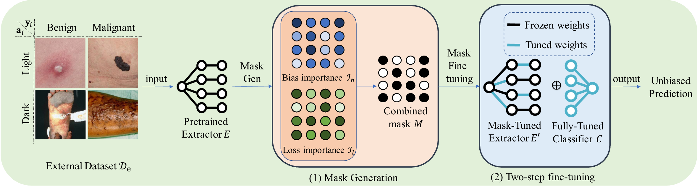
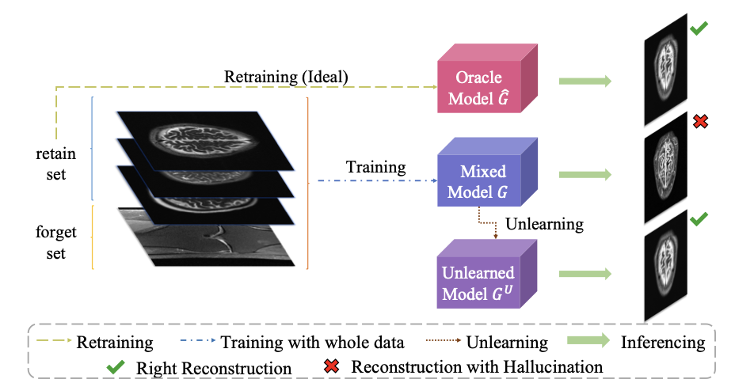
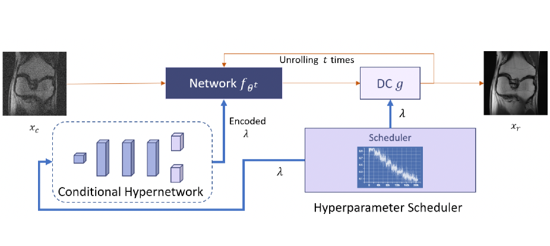
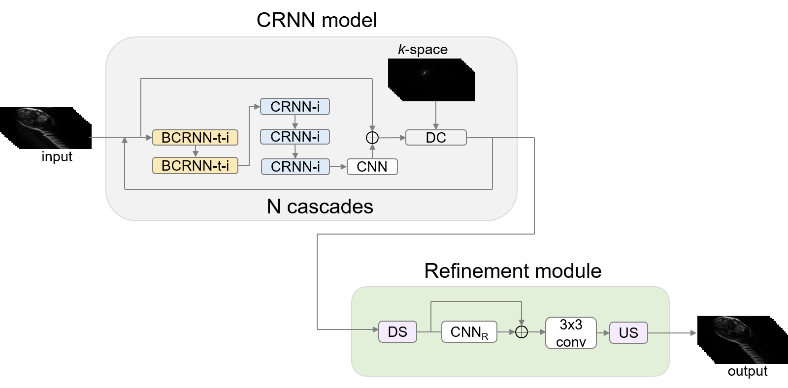



<h2>2025</h2>



<b>Yuyang Xue</b>, E Moroshko, F Chen, J Sun, S McDonagh, SA Tsaftaris
 
<b>Abstract</b>: Existing concept erasure methods struggle with under-erasure (leaving residual traces) or over-erasure (eliminating unrelated concepts). We propose CRCE, which leverages LLMs to identify semantically related coreferential concepts to erase alongside the target and distinct concepts to preserve, enabling precise concept removal without unintended collateral damage. CRCE outperforms existing methods on object, identity, and IP erasure tasks.
 

<a href="https://arxiv.org/abs/2503.14232">[Paper]</a>




J Yan, F Chen, <b>Yuyang Xue</b>, Y Du, K Vilouras, SA Tsaftaris, S McDonagh
 
<b>Abstract</b>: SWiFT finds the relative and distinct contributions of model parameters to both bias and predictive performance, applying a two-step fine-tuning process with different gradient flows per parameter. The method consistently reduces model bias while maintaining competitive or superior diagnostic accuracy across dermatological and chest X-ray datasets, requiring only a small external dataset.
 

<a href="https://arxiv.org/abs/2508.18826">[Paper]</a>




J Lyu, C Qin, S Wang, F Wang, ..., <b>Yuyang Xue</b>, ..., SA Tsaftaris
 
The CMRxRecon challenge at MICCAI 2023 benchmarked deep learning-based cardiac MRI reconstruction. Over 285 teams participated; 22 submitted solutions. All competing methods used deep learning, with E2E-VarNet achieving top performance. This paper summarizes results, winning approaches, and future directions for accelerated cardiac MRI.
 

<a href="https://arxiv.org/abs/2404.01082">[Paper]</a>
<a href="https://github.com/CmrxRecon/CMRxRecon">[Code]</a>




F Haider, E Moroshko, <b>Yuyang Xue</b>, SA Tsaftaris
 
An empirical investigation into whether generative models adequately capture rare factors of variation in training data, with implications for fairness and diversity in AI-generated content.
 





X Qiu, Y Zhou, X Zhang, <b>Yuyang Xue</b>, X Lin, X Dai, H Tang, G Liu, R Yang, Z Li, et al.
 
A multi-layer hybrid alignment network for video super-resolution exploiting temporal correlations across frames via hybrid deformable alignment.
 





Y Zhou, <b>Yuyang Xue</b>, X Zhang, W Deng, T Wang, T Tan, Q Gao, T Tong
 
A parameter-efficient fine-tuning framework that adapts a pretrained single-image SR model to the stereo setting, achieving competitive performance with significantly reduced trainable parameters.
 



<h2>2024</h2>



<b>Yuyang Xue</b>, J Yan, R Dutt, F Haider, J Liu, S McDonagh, SA Tsaftaris
 
<b>Abstract</b>: We propose BMFT, a post-processing method that enhances model fairness in significantly fewer epochs without requiring original training data. BMFT produces a mask over model parameters to identify weights most responsible for biased predictions, then fine-tunes them in two phases: first updating the feature extractor, then reinitializing and fine-tuning the classification layer.
 

<a href="https://arxiv.org/abs/2408.06890">[Paper]</a>
<a href="https://github.com/vios-s/BMFT">[Code]</a>




<b>Yuyang Xue</b>, J Liu, S McDonagh, SA Tsaftaris
 
<b>Abstract</b>: Combining training data can lead to hallucinations and reduced image quality in reconstructed MRI. We use machine unlearning to remove hallucinations as a proxy for undesired data removal, showing that unlearning is achievable without full retraining. High performance is maintained even with only a subset of retain data, with implications for privacy compliance and bias mitigation.
 

<a href="https://arxiv.org/abs/2405.15517">[Paper]</a>
<a href="https://github.com/vios-s/ReconUnlearning">[Code]</a>




<b>Yuyang Xue</b>, C Qin, SA Tsaftaris
 
<b>Abstract</b>: We propose a conditional hyperparameter network that eliminates the need for data augmentation while maintaining robust performance under various noise levels. The model withstands various input noise levels during the test stage, and we present a hyperparameter sampling strategy that accelerates training convergence, achieving the highest accuracy and image quality in all settings compared to baselines.
 

<a href="https://arxiv.org/abs/2402.08692">[Paper]</a>
<a href="https://github.com/vios-s/Inference_Denoising_MRI_Recon">[Code]</a>




Y Zhou, <b>Yuyang Xue</b>, J Bi, W He, X Zhang, J Zhang, W Deng, R Nie, J Lan, Q Gao, T Tong
 
A real-world stereo image super-resolution method combining a hybrid degradation pipeline with a discriminator that leverages cross-view stereo consistency information.
 





H Tang, Y Zhou, Y Chen, X Zhang, <b>Yuyang Xue</b>, X Lin, X Dai, X Qiu, Q Gao, T Tong
 
A two-stage colorization framework using a learned color codebook to produce vivid, diverse, and semantically consistent colorization results.
 





J Zhang, Y Zhou, J Bi, <b>Yuyang Xue</b>, W Deng, W He, T Zhao, K Sun, T Tong, Q Gao, et al.
 
A blind SR network that jointly estimates degradation kernels and exploits structural priors to handle real-world complex degradations for high-fidelity image super-resolution.
 





Y Zhou, <b>Yuyang Xue</b>, W Deng, X Zhang, Q Gao, T Tong
 
A method to efficiently adapt powerful single-image SR pre-trained models to stereo image SR via lightweight cross-view interaction modules.
 

<a href="https://arxiv.org/abs/2407.03598">[Paper]</a>


<h2>2023</h2>



<b>Yuyang Xue</b>, Y Du, G Carloni, E Pachetti, C Jordan, SA Tsaftaris
 
<b>Abstract</b>: We investigate a convolutional recurrent neural network (CRNN) architecture for supervised cine cardiac MRI reconstruction, combined with a single-image super-resolution refinement module. Our approach improves single-coil reconstruction by 4.4% in structural similarity and 3.9% in normalized mean square error over a plain CRNN, and applies a high-pass loss filter for greater emphasis on high-frequency details.
 

<a href="https://arxiv.org/abs/2309.13385">[Paper]</a>
<a href="https://github.com/vios-s/CMRxRECON_Challenge_EDIPO">[Code]</a>




Y Du, <b>Yuyang Xue</b>, R Dharmakumar, SA Tsaftaris
 
The first fairness analysis in deep learning-based brain MRI reconstruction, revealing statistically significant performance biases between gender and age subgroups. The study implements baseline ERM and rebalancing strategies to explore sources of unfairness.
 

<a href="https://arxiv.org/abs/2309.14392">[Paper]</a>




Y Zhou, <b>Yuyang Xue</b>, W Deng, R Nie, J Zhang, J Pu, Q Gao, J Lan, T Tong
 
A plug-and-play Stereo Cross Global Learnable Attention Module (SCGLAM) that captures long-range cross-view dependencies, outperforming prior methods on severely degraded low-resolution stereo pairs.
 

<a href="https://openaccess.thecvf.com/content/CVPR2023W/NTIRE/html/Zhou_Stereo_Cross_Global_Learnable_Attention_Module_for_Stereo_Image_Super-Resolution_CVPRW_2023_paper.html">[Paper]</a>




J Lan, M Chen, J Wang, M Du, Z Wu, H Zhang, <b>Yuyang Xue</b>, T Wang, L Chen, C Xu, et al.
 
A semi-supervised and weakly-supervised learning framework that significantly reduces annotation workload for training a gastric cancer pathological diagnosis system, achieving clinically viable performance with limited labeled data.
 





Z Guo, J Lan, J Wang, Z Hu, Z Wu, J Quan, Z Han, T Wang, M Du, Q Gao, ..., <b>Yuyang Xue</b>, et al.
 
A multimodal multiscale deep learning approach combining whole-slide pathological images with clinical data to predict lymph node metastasis in gastric cancer.
 





X Zhou, Z Li, <b>Yuyang Xue</b>, S Chen, M Zheng, C Chen, Y Yu, X Nie, X Lin, L Wang, et al.
 
A cascaded framework combining unsupervised pretraining with supervised fine-tuning for robust biomedical image diagnosis and segmentation with limited labeled data.
 



<h2>2022</h2>



<b>Yuyang Xue</b>, X Ye, L Wei, X Zhang, T Sakurai, L Wei
 
<b>Abstract</b>: CPPFormer applies a Transformer-based architecture to the precise prediction of cell-penetrating peptides (CPPs), leveraging self-attention to capture sequence-level dependencies. By combining the attention mechanism with a few manually engineered features, CPPFormer achieves 92.16% accuracy on the CPP924 dataset, outperforming existing CNN and RNN-based methods.
 

<a href="https://pubmed.ncbi.nlm.nih.gov/34544332/">[Paper]</a>




R Li, J Xie, <b>Yuyang Xue</b>, W Zou, T Tong, M Luo, Q Gao
 
A multi-stage network exploiting dual-pixel sensor information to progressively restore sharp images from defocus blur.
 





L Guo, J Xie, <b>Yuyang Xue</b>, R Li, W Zheng, T Tong, Q Gao
 
A grayscale-prior-guided network for low-light image enhancement that exploits structural information from the luminance channel to guide color enhancement.
 



<h2>2021</h2>



L Wei, X Ye, <b>Yuyang Xue</b>, T Sakurai, L Wei
 
ATSE combines graph neural networks for structural modeling with attention mechanisms for evolutionary information to predict peptide toxicity, providing interpretable residue-level attention weights.
 





J Lan, S Cai, <b>Yuyang Xue</b>, Q Gao, M Du, H Zhang, Z Wu, Y Deng, Y Huang, T Tong, et al.
 
An invertible neural network-based approach for unpaired histopathology stain normalization, offering exact invertibility and stable training compared to GAN-based methods, with channel attention for detail preservation.
 





Y Huang, <b>Yuyang Xue</b>, J Lan, Y Deng, G Chen, H Zhang, M Dang, T Tong
 
A deep learning pipeline for automatic detection of positive lymph nodes in gastric cancer histopathological whole-slide images.
 





L Wu, <b>Yuyang Xue</b>, T Tong, M Du, Q Gao
 
An automatic colorization algorithm leveraging foreground semantic segmentation to guide perceptually consistent color assignment.
 



<h2>2019</h2>



<b>Yuyang Xue</b>, J Su
 
<b>Abstract</b>: A post-processing CNN leveraging attention mechanisms to reduce compression artifacts in learned image codecs. By focusing attention on regions with the most severe distortions, the network improves perceptual quality without modifying the underlying compression algorithm.
 





S Cai, <b>Yuyang Xue</b>, Q Gao, M Du, G Chen, H Zhang, T Tong
 
A GAN-based stain style transfer method using transitive adversarial learning to handle multi-domain stain normalization without requiring direct paired data between all domain pairs.
 



<h2>2017</h2>



H Zhang, Y Niu, <b>Yuyang Xue</b>
 
A curated database for benchmarking image color correction algorithms against human subjective perceptual consistency judgments.
 




