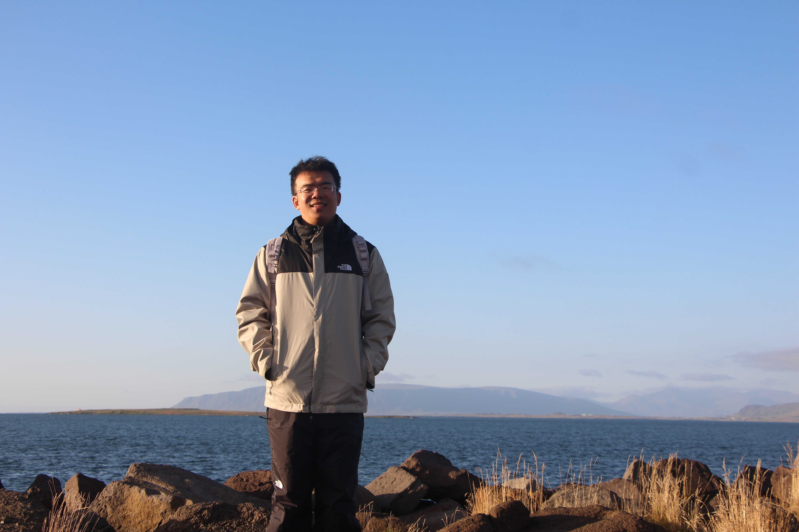
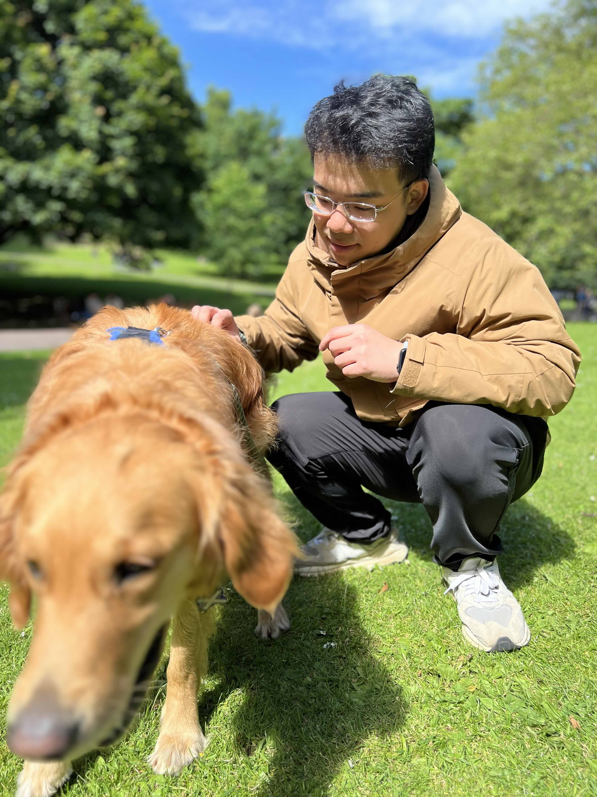


你好，我是雨阳。 






薛雨阳博士毕业于爱丁堡大学工程学院，主要研究方向包括对抗性机器学习、视觉-语言模型以及医学图像处理等前沿领域。在学术生涯中，他与国内外顶尖研究机构开展了广泛深入的合作研究，如由英国工程与自然科学研究理事会（EPSRC）资助的医疗健康人工智能与真实数据因果关系中心（CHAI）、佳能欧洲区医疗总部、位于雅典的阿基米德卓越人工智能研究中心以及福建省医疗器械和医药技术重点实验室。
 
 
作为科学界活跃的一员，薛博士曾受邀在2024年国际生物医学成像研讨会（ISBI）上组织了深受关注的教程，并在CVPR、MICCAI等顶级学术会议上发表演讲。他持有中国工业和信息化部颁发的中级软件工程师资格证书，并且是IEEE和国际医学磁共振学会（ISMRM）会员。薛雨阳在南安普顿大学获得计算机科学硕士学位，并在福州大学获得学士学位。凭借在机器学习应用领域的深厚积累，他参与撰写了超过25篇发表于顶级会议和期刊的学术论文，并拥有两项技术专利。此外，他还经常担任CVPR、ICLR、ECCV、MICCAI、ISBI等顶级会议以及TNNLS、TMI、MedAI等权威期刊的审稿人。
 
 
您可以通过以下链接了解更多：<a href="docs/Yuyang_CV.pdf">英文简历</a>, <a href="docs/zh_Yuyang_CV.pdf">中文简历</a>。










<ul>
  <li>
    口头报告 (Oral Presentation)
    <ul>MICCAI 2024，BMFT：通过基于偏差的权重掩码微调实现公平性</ul>
  </li>
  <li>
    受邀讲者 (Invited Speaker)
    <ul>MLIS 2024，擦除以增强：MRI重建中数据高效的机器去学习，<a href="https://www.youtube.com/watch?v=8GSYCXoiDaQ&t=5s">Youtube</a></ul>
  </li>
<li>
    教程 (Tutorial)
    <ul><a href="https://vios.science/tutorials/DiMEDIA-2024">ISBI 2024</a>，DiMEDIA：医学影像与分析中的扩散模型</ul>
  </li>
</ul>





<ul>
  <li>国际计算机视觉与模式识别会议 (CVPR)</li>
  <li>国际学习表征会议 (ICLR)</li>
  <li>医学图像计算和计算机辅助干预国际会议 (MICCAI)</li>
  <li>欧洲计算机视觉会议 (ECCV)</li>
  <li>IEEE国际生物医学成像研讨会 (ISBI)</li>
  <li>IEEE神经网络和学习系统汇刊 (TNNLS)</li>
  <li>IEEE医学影像汇刊 (TMI)</li>
  <li>医学影像分析 (MedAI)</li>
</ul>




