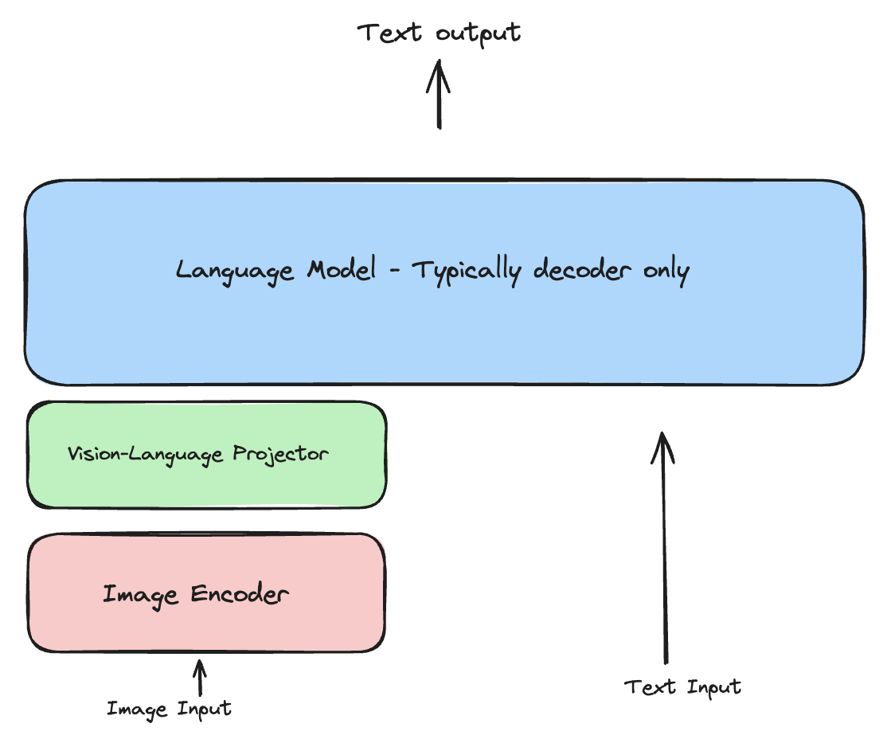
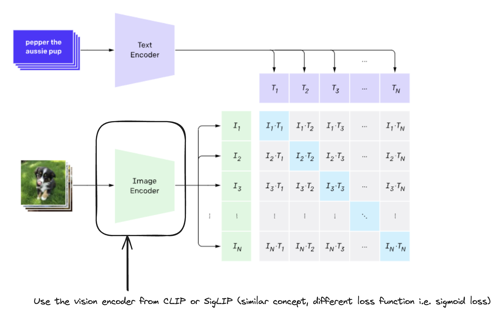
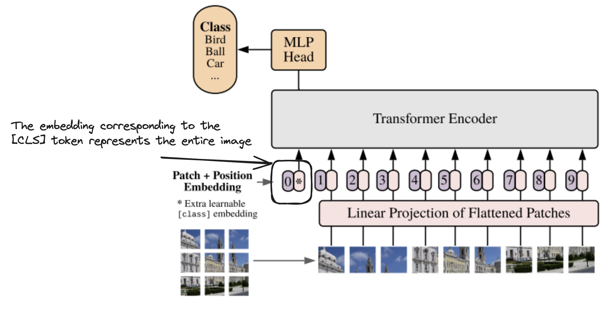


This blog is a implmentation of [Seemore](https://huggingface.co/blog/AviSoori1x/seemore-vision-language-model) from huggingface blog. 




I am doing my project on "Vision-Language Model (VLM) Unlearning" and first I need to get more understanding of VLM. I just came across a article from huggingface blog and I found it interesting.

Here I will record my implementation details with the seemore tutorial and note what is important.

Let's get started.

## Preliminary

First we need to do some chores before we really implementing the core components.

```python {class="my-class" id="my-codeblock" lineNos=inline tabWidth=2}

import base64
import io
import pandas as pd

from PIL import Image
import torchvision.transforms as transforms

import torch
import torch.nn as nn
from torch.nn import functional as F
from torch.nn import init

device = 'cuda' if torch.cuda.is_available() else 'cpu'
```

We will use the `tinyshakespear` dataset to build the encoding and decoding functions. For the sake of brevity we do not pretrain the decoder model on it.

Here we use a very simple conversion of each character to a corresponding integer. We also construct two mappings `stoi` and `itos`.

```python {class="my-class" id="my-codeblock" lineNos=inline tabWidth=2 linenostart=15}
text_path = './input.txt'
with open(text_path, 'r', encoding='utf-8') as f:
    text = f.read()

# get all unique characters in the text
chars = sorted(list(set(text)))
# create a mapping from unique characters to indices
stoi = {ch: i for i, ch in enumerate(chars)}
# stoi contains 65 characters and index mapping, add an extra ''
stoi['']=65
# create a mapping from indices to unique characters
itos = {i: ch for ch, i in stoi.items()}
```

And we construct two very simple `encode` and `decode` lambda function to get a list of integers from a string, and vice versa.

```python {class="my-class" id="my-codeblock" lineNos=inline tabWidth=2 linenostart=27}
# encode a string: take a string, output a list of integers
encode = lambda s: torch.tensor([stoi[ch] for ch in s], dtype=torch.long)
# decode a list of integers: take a list of integers, output a string
decode = lambda l: ''.join([itos[i] for i in l])
vocab_size = len(stoi)
```

## VLM components

There are 3 main components for a VLM:

- **Image Encoder**. 
  - It is used to extract visual features from images.
  - It used a from stratch implementation of the original vision transformer in CLIP.
- **Vision-Language Projector**.
  - Image embeddings are not of the same shape as text embeddings used by the decoder. So we need to change dimensionality of image features extracted by the image encoder to match what's observed in the text embedding space.
  - So image features become 'visual tokens' for the decoder.
  - This could be a single layer of an MLP.
- **A decoder only language model**.
  - This is the component that ultimately generates text.
  - In this implementation the projection module is incorporated to the decoder.
  - Typically this is not observed.



In summary, an image encoder extracts feature from a given image, passes these image embeddings to a vision-language projector which projects these image embeddings to the text embedding space, that is then concatenated with the text embeddings from the text inputs and used to autoregressively generated text by a decoder only language model.



### Image Encoder

To implement vision transformer from scratch we will create a `PatchEmbeddings` class that can take an image and create a sequence of patches.

This process is crucial for enabling the transformer architecture to process visual data effectively, specifically using the attention blocks in the subsequent steps of the architecture.



Here we create a convolutional layer to extract patch embeddings. We assume the input image has 3 color channels, `hidden_dim` sets the number of output channels to match the hidden dimension, `kernel_size=patch_size` and `stride=patch_size` ensure each patch is separately embedded.

``` python {lineNos=inline tabWidth=2 linenostart=27}
class PatchEmbeddings(nn.Module):
    def __init__(self, img_size=96, patch_size=16, hidden_dim=512):
        super().__init__()
        self.img_size = img_size
        self.patch_size = patch_size
        self.num_patches = (img_size // patch_size) ** 2
        # Ensure the convolution outputs a feature map with hidden_dim channels
        self.conv = nn.Conv2d(in_channels=3, out_channels=hidden_dim,
                              kernel_size=patch_size, stride=patch_size)

    def forward(self, X):
        X = self.conv(X)
        X = X.flatten(2)  # Flatten the patch dimensions
        X = X.transpose(1, 2)  # [B, num_patches, hidden_dim]
        return X
```

The input image is broken down to 
\\( \mathrm{imgsize} / \mathrm{patchsize} \\) patches using the convolution layer and projected into vectors with a channel dimension of 512.

The most components in the trasnformer blocks, such as the attention head, multi-head attention, and the MLP in each attention head are mostly identical across the ViT we are implementing ofr the `visual token` generation and the decoder language model for the actual text output generation.

*GELU* used quite often in ViT and *ReLU* used in text transformers. However, it seems that *GELU* is being used for both due to its resultant model performance.

``` python {lineNos=inline tabWidth=2 linenostart=42}
class MLP(nn.Module):
    def __init__(self, n_embd, dropout=0.1, is_decoder=True):
        super().__init__()
        layers = [
            nn.Linear(n_embd, 4 * n_embd),
            nn.ReLU() if is_decoder else nn.GELU(),
            nn.Linear(4 * n_embd, n_embd),
            nn.Dropout(dropout)
        ]
        self.net = nn.Sequential(*layers)

    def forward(self, x):
        return self.net(x)
```

The only key difference is the masking applied in each attention head in the decoder language model. This is done to ensure the integrity of the autoregressive language generation process, particularly in a decoder-only model. This masking technique is crucial as it obscures any information following the current token's position, thereby directing the model's attention to only the preceding parts of the sequence. Such an attention mechanism is known as *causal self-attention*.


``` python {lineNos=inline tabWidth=2 linenostart=55}
class Head(nn.Module):
    def __init__(self, n_embd, head_size, dropout=0.1, is_decoder=False):
        super().__init__()
        self.key = nn.Linear(n_embd, head_size, bias=False)
        self.query = nn.Linear(n_embd, head_size, bias=False)
        self.value = nn.Linear(n_embd, head_size, bias=False)
        self.dropout = nn.Dropout(dropout)
        self.is_decoder = is_decoder

    def forward(self, x):
        B, T, C = x.shape
        k = self.key(x)
        q = self.query(x)
        v = self.value(x)

        # Compute attention scores
        wei = q @ k.transpose(-2, -1) * (C**-0.5)
        if self.is_decoder:
            # Ensure the mask is the correct size for the current sequence length
            tril = torch.tril(torch.ones(T, T, dtype=torch.bool, device=device))
            wei = wei.masked_fill(tril == 0, float('-inf'))

        # Apply softmax to get probabilities
        wei = F.softmax(wei, dim=-1)
        wei = self.dropout(wei)

        # Perform weighted aggregation of values
        out = wei @ v
        return out
```

The implementation of multihead attention is as follows:

``` python {lineNos=inline tabWidth=2 linenostart=84}
class MultiHeadAttention(nn.Module):
    def __init__(self, n_embd, num_heads, dropout=0.1, is_decoder=False):
        super().__init__()
        #Using assert statements for this type of checks is a good idea in general in your code
        assert n_embd % num_heads == 0, "n_embd must be divisible by num_heads"
        self.heads = nn.ModuleList([
            Head(n_embd, n_embd // num_heads, dropout, is_decoder)
            for _ in range(num_heads)
        ])
        self.proj = nn.Linear(n_embd, n_embd)
        self.dropout = nn.Dropout(dropout)

    def forward(self, x):
        out = torch.cat([h(x) for h in self.heads], dim=-1)
        out = self.dropout(self.proj(out))
        return out
```

Each encoder transformer blocks looks as follows:

``` python {lineNos=inline tabWidth=2 linenostart=100}
class Block(nn.Module):
    def __init__(self, n_embd, num_heads, dropout=0.1, is_decoder=False):
        super().__init__()
        self.ln1 = nn.LayerNorm(n_embd)
        self.attn = MultiHeadAttention(n_embd, num_heads, dropout, is_decoder)
        self.ln2 = nn.LayerNorm(n_embd)
        self.ffn = nn.Sequential(
            nn.Linear(n_embd, 4 * n_embd),
            nn.GELU(),
            nn.Linear(4 * n_embd, n_embd),
        )

    def forward(self, x):
        original_x = x  # Save for residual connection
        x = self.ln1(x)
        attn_output = self.attn(x)
        x = original_x + attn_output
        x = self.ln2(x)
        ffn_output = self.ffn(x)
        x = x + ffn_output
        return x
```

Now all this can be be put together to implement a Vision Transformer:

``` python {lineNos=inline tabWidth=2 linenostart=121}
class ViT(nn.Module):
    def __init__(self, img_size, patch_size, num_hiddens, num_heads, num_blks, emb_dropout, blk_dropout):
        super().__init__()
        self.patch_embedding = PatchEmbeddings(img_size, patch_size, num_hiddens)
        self.cls_token = nn.Parameter(torch.zeros(1, 1, num_hiddens))
        num_patches = (img_size // patch_size) ** 2
        self.pos_embedding = nn.Parameter(torch.randn(1, num_patches + 1, num_hiddens))
        self.dropout = nn.Dropout(emb_dropout)
        self.blocks = nn.ModuleList([Block(num_hiddens, num_heads, blk_dropout, is_decoder=False) for _ in range(num_blks)])
        self.layer_norm = nn.LayerNorm(num_hiddens)

    def forward(self, X):
        x = self.patch_embedding(X)
        cls_tokens = self.cls_token.expand(x.shape[0], -1, -1)
        x = torch.cat((cls_tokens, x), dim=1)
        x += self.pos_embedding
        x = self.dropout(x)
        for block in self.blocks:
            x = block(x)
        x = self.layer_norm(x[:, 0])
        return x
```

### Vision-Language Projector

We cannot directly concatenate this to the text embeddings. We need to project this from the dimensionality of image embeddings from the vision transformer to the dimensionality of text embeddings.

This can be a single learnable layer followed by a nonlienarity or an MLP. The reason that an interesting current trend of keeping both the pretrained vision encoder and language decoder frozen during the VLM training phase. So giving more parameters to learn via this connection module could improve the ability of the overall VLM to generalize and help in the downstream instruction tuning process.

Here’s the implementation of this projection module. It’s not too different from the MLP used in the transformer blocks.

```python {lineNos=inline tabWidth=2 linenostart=142}
class MultiModalProjector(nn.Module):
    def __init__(self, n_embd, image_embed_dim, dropout=0.1):
        super().__init__()
        self.net = nn.Sequential(
            nn.Linear(image_embed_dim, 4 * image_embed_dim),
            nn.GELU(),
            nn.Linear(4 * image_embed_dim, n_embd),
            nn.Dropout(dropout)
        )

    def forward(self, x):
        x = self.net(x)
        return x
```

### Language Decoder

The final component we need to look at is the decoder language model. I have integrated the projection module into the decoder model class implementation. 

There’s no easy way to directly feed in reshaped embeddings in this implementation, so I’ve had to improvise a little. 

However in using pretrained models with the Hugging Face API or any other modern library that allows you to use pretrained large language models, you can directly feed embeddings as input to the model.

Some interesting exercises:

- How the image embeddings are reshaped using the vision language projector to match that of text embeddings.
- Then concatenated with token embedding.
- Subsequently combined with position embeddings and used to calculate a loss function (and eventually generate text).

The crucial parts of this decoder implementation is given below. Note how the `is_decoder` flag is passed as `True` to use the masked version of the self attention blocks, resulting in causal scaled dot product self attention in the language decoder. 

``` python {lineNos=inline tabWidth=2 linenostart=155}
class DecoderLanguageModel(nn.Module):
    def __init__(self, n_embd, image_embed_dim, vocab_size, num_heads, n_layer, use_images=False):
        super().__init__()
        self.use_images = use_images
        self.token_embedding_table = nn.Embedding(vocab_size, n_embd)
        self.position_embedding_table = nn.Embedding(1000, n_embd)
        if use_images:
            self.image_projection = MultiModalProjector(n_embd, image_embed_dim)
        self.blocks = nn.Sequential(*[Block(n_embd, num_heads, is_decoder=True) for _ in range(n_layer)])
        self.ln_f = nn.LayerNorm(n_embd)
        self.lm_head = nn.Linear(n_embd, vocab_size)

    def forward(self, idx, image_embeds=None, targets=None):
        tok_emb = self.token_embedding_table(idx)
        if self.use_images and image_embeds is not None:
            img_emb = self.image_projection(image_embeds).unsqueeze(1)
            tok_emb = torch.cat([img_emb, tok_emb], dim=1)
        pos_emb = self.position_embedding_table(torch.arange(tok_emb.size(1), device=device)).unsqueeze(0)
        x = tok_emb + pos_emb
        x = self.blocks(x)
        x = self.ln_f(x)
        logits = self.lm_head(x)
        if targets is not None:
            if self.use_images and image_embeds is not None:
                batch_size = idx.size(0)
                targets = torch.cat([torch.full((batch_size, 1), -100, dtype=torch.long, device=device), targets], dim=1)
            loss = F.cross_entropy(logits.view(-1, logits.size(-1)), targets.view(-1), ignore_index=-100)
            return logits, loss
        return logits

    def generate(self, idx, image_embeds, max_new_tokens):
        B, T = idx.shape
        generated = idx

        if self.use_images and image_embeds is not None:
            img_emb = self.image_projection(image_embeds).unsqueeze(1)
            current_output = torch.cat([img_emb, self.token_embedding_table(idx)], dim=1)
        else:
            current_output = self.token_embedding_table(idx)

        for i in range(max_new_tokens):
            T_current = current_output.size(1)
            current_pos_emb = self.position_embedding_table(torch.arange(T_current, device=device)).unsqueeze(0)
            current_output += current_pos_emb

            for block in self.blocks:
                current_output = block(current_output)

            logits = self.lm_head(current_output[:, -1, :])
            probs = F.softmax(logits, dim=-1)
            idx_next = torch.multinomial(probs, num_samples=1)
            generated = torch.cat((generated, idx_next), dim=1)
            idx_next_emb = self.token_embedding_table(idx_next)
            current_output = torch.cat((current_output, idx_next_emb), dim=1)

        return generated
```

### Summary

Now that we have our three key components, we can put it all together into a Vision Language Model. The full implementation is given below. All that’s happening here is:

- Get image features from the vision encoder (Here it’s a vision transformer, but it could be any model that could generate features from an image input such as a `ResNet` or a traditional convolutional neural network (needless to say performance may suffer))
- A projection module for projecting image tokens to the same embedding space as text embeddings for the decoder (this projector is integrated with the decoder in this implementation)
- A decoder language model for generating text conditioned on a preceding image.

```python {lineNos=inline tabWidth=2 linenostart=211}
class VisionLanguageModel(nn.Module):
    def __init__(self, n_embd, image_embed_dim, vocab_size, n_layer, img_size, patch_size, num_heads, num_blks, emb_dropout, blk_dropout):
        super().__init__()
        num_hiddens = image_embed_dim  # Set num_hiddens equal to image_embed_dim
        assert num_hiddens % num_heads == 0, "num_hiddens must be divisible by num_heads"
        self.vision_encoder = ViT(img_size, patch_size, num_hiddens, num_heads, num_blks, emb_dropout, blk_dropout)
        self.decoder = DecoderLanguageModel(n_embd, image_embed_dim, vocab_size, num_heads, n_layer, use_images=True)

    def forward(self, img_array, idx, targets=None):
        image_embeds = self.vision_encoder(img_array)

        if image_embeds.nelement() == 0 or image_embeds.shape[1] == 0:
            raise ValueError("somethign is messed up with the ViT model. It's returning an empty tensor or the embedding dimension is empty")

        if targets is not None:
            logits, loss = self.decoder(idx, image_embeds, targets)
            return logits, loss
        else:
            logits = self.decoder(idx, image_embeds)
            return logits

    def generate(self, img_array, idx, max_new_tokens):
      image_embeds = self.vision_encoder(img_array)

      if image_embeds.nelement() == 0 or image_embeds.shape[1] ==0:
        raise ValueError("somethign is messed up with the ViT model. It's returning an empty tensor or the embedding dimension is empty")

      generated_tokens = self.decoder.generate(idx, image_embeds, max_new_tokens)
      return generated_tokens
```

### Extra code for training

``` python {lineNos=inline tabWidth=2 linenostart=240}
def base64_to_tensor(base64_str, img_size=96):
    image = Image.open(io.BytesIO(base64.b64decode(base64_str)))
    if image.mode != 'RGB':
        image = image.convert('RGB')
    transform = transforms.Compose([
        transforms.Resize((img_size, img_size)),
        transforms.ToTensor(),
        transforms.Normalize(mean=[0.485, 0.456, 0.406], std=[0.229, 0.224, 0.225])
    ])
    return transform(image).unsqueeze(0)  # Add batch dimension

#Adjusting the data loader from makemore for multimodal data
def get_batch(df, batch_size, split='train', img_size=96, val_batch_size=8):
    # Split data into training and validation sets
    n = int(0.9 * len(df))  # first 90% will be train, rest val
    df_train = df.iloc[:n]
    df_val = df.iloc[n:]
    data = df_train if split == 'train' else df_val
    batch_size = batch_size if split == 'train' else val_batch_size
    replace = False if split == 'train' else True
    batch = data.sample(n=batch_size, replace=replace)

    images = torch.cat([base64_to_tensor(img, img_size) for img in batch['b64string_images']], dim=0).to(device)
    text_indices = [torch.tensor(encode(desc), dtype=torch.long) for desc in batch['caption']]
    max_length = max(len(t) for t in text_indices)

    padded_text = torch.full((batch_size, max_length), fill_value=stoi[''], dtype=torch.long).to(device)
    for i, text in enumerate(text_indices):
        padded_text[i, :len(text)] = text

    targets = torch.cat([padded_text[:, 1:], torch.full((batch_size, 1), fill_value=stoi[''], dtype=torch.long, device=device)], dim=1)

    # Truncate or pad targets to match the length of padded_text
    if targets.size(1) > padded_text.size(1):
        targets = targets[:, :padded_text.size(1)]
    elif targets.size(1) < padded_text.size(1):
        targets = torch.cat([targets, torch.full((batch_size, padded_text.size(1) - targets.size(1)), fill_value=stoi[''], dtype=torch.long, device=device)], dim=1)

    return images, padded_text, targets

#Adjusting the training loop from makemore for multimodal data
def train_model(model, df, epochs, vocab_size, img_size=96):
    optimizer = torch.optim.Adam(model.parameters(), lr=learning_rate)
    model.to(device)
    for epoch in range(epochs):
        model.train()
        for _ in range(max_iters):
            images, idx, targets = get_batch(df, batch_size, 'train', img_size)
            optimizer.zero_grad()
            logits, loss = model(images, idx, targets)
            loss.backward()
            optimizer.step()
            if _ % eval_interval == 0:
                print(f"Loss at iteration {_}: {loss.item()}")
        val_loss = estimate_loss(model, df, 'val', img_size, val_batch_size=8)
        print(f"Validation Loss after epoch {epoch}: {val_loss}")

def estimate_loss(model, df, split, img_size=96, val_batch_size=8):
    losses = []
    model.eval()
    for _ in range(eval_iters):
        images, idx, targets = get_batch(df, batch_size, split, img_size, val_batch_size=val_batch_size)
        _, loss = model(images, idx, targets)
        losses.append(loss.item())
    return sum(losses) / len(losses)

df = pd.read_csv("./inputs.csv")
#Expanding dataframe so that there's enough data to test. This is just duplicating data. A real dataset would have more rows
df = pd.concat([df] * 30)[['b64string_images', 'caption']]
df.shape

batch_size = 16 # how many independent sequences will we process in parallel?
block_size = 32 # what is the maximum context length for predictions?
max_iters = 100
eval_interval = 10
learning_rate = 1e-3
epochs=1
device = 'cuda' if torch.cuda.is_available() else 'cpu'
eval_iters = 40
num_blks= 3
head_size = 16
n_embd = 128
n_head = 8
n_layer = 8
dropout = 0.1
img_size=96
patch_size =16
image_embed_dim = 512
emb_dropout = blk_dropout =0.1

# Initialize the model
model = VisionLanguageModel(n_embd, image_embed_dim, vocab_size, n_layer, img_size, patch_size, n_head, num_blks, emb_dropout, blk_dropout)
model.to(device)

# Dummy data to initialize lazy modules
dummy_img = torch.randn(1, 3, img_size, img_size).to(device)
dummy_idx = torch.randint(0, vocab_size, (1, block_size)).to(device)
model(dummy_img, dummy_idx)  # Forward pass to initialize all parameters

# Train the model
train_model(model, df, epochs, vocab_size, img_size)
```

In practice, the commonly observed sequence is:

1. Get pretrained vision encoder from SigLIP or CLIP (both come in difference sizes). Freeze weights (i.e. don’t update during backward pass in training).
2. Get pretrained decoder only language model e.g. all the way from TinyLLaMA, Phi-2 etc. to Llama 3 (or even much bigger in the case of GPT-4 and Grok 1.5 etc.). Freeze weights.
3. Implement a projection module and train a VLM module much like what we have here, but only updating the weights of this projection module. This would effectively be the pretraining phase.
4. Then during the instruction finetuning keep both the projection module and the decoder language model unfrozen and update weights of both in the backward pass.