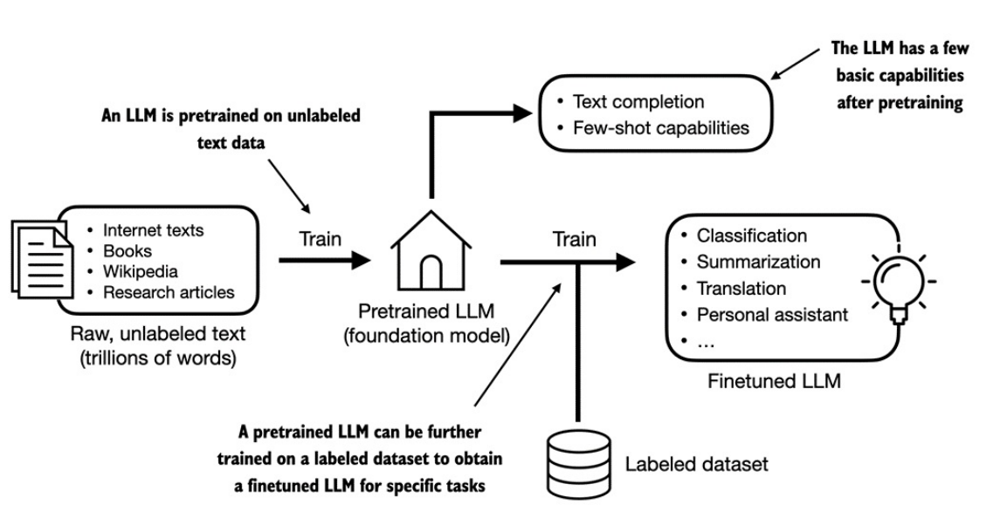
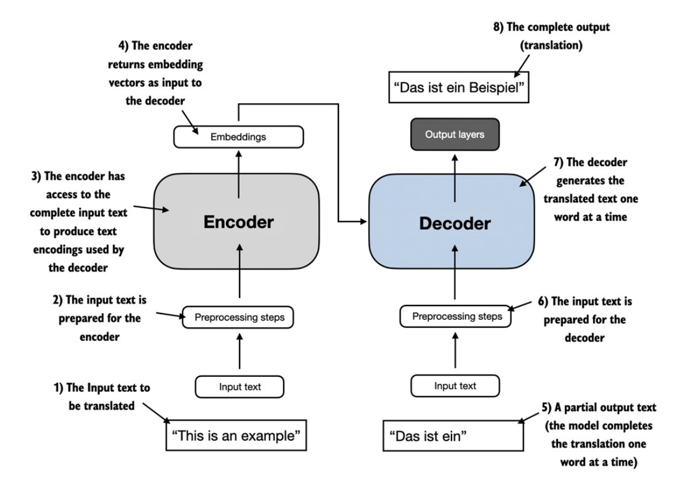
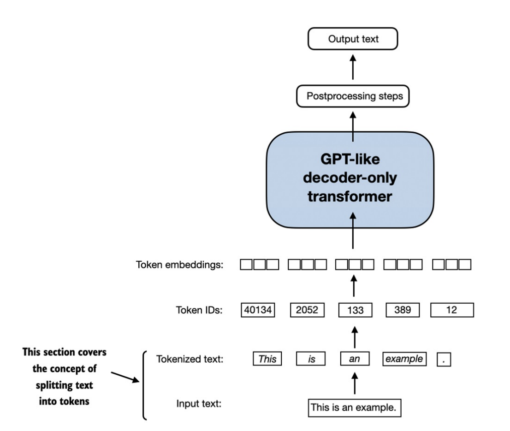

 

This is a series of blogs that detailed recorded the exploration of the book [Build a Large Language Model (From Scratch)](http://mng.bz/orYv). The corresponding code repository is [here](https://github.com/rasbt/LLMs-from-scratch). Please support the author and the book.


This article is an introductory of the "LLM from scratch" serie. 

## Introduction

### What is LLM?

- An LLM, a large language model, is a neural network designed to understand, generate, and respond to human-like text.
  - The "large" in large language model refers to both the model's size in terms of parameters and the immense dataset on which it's trained.
- LLMs utilize an architecture called the *transformer*, which allows them to pay selective attention to different parts of the input when making predictions, making them especially adept at handling the nuances and complexities of human language.
- LLMs are also often referred to as a form of generative artificial intelligence (AI), often abbreviated as generative AI or GenAI.

### Applications of LLMs

- Machine translation
- Text generation
- Sentiment analysis
- Text summarisation
- and many others.

### Stages of building and using LLMs



- The general process of creating an LLM includes pretraining and finetuning.
  - This pretrained model then serves as a foundational resource that can be further refined through finetuning, a process where the model is specifically trained on a narrower dataset that is more specific to particular tasks or domains.
  - The two most popular categories of finetuning LLMs include *instruction finetuning* and *finetuning for classification* tasks.
    - In instruction-finetuning, the labeled dataset consists of instruction and answer pairs, such as a query to translate a text accompanied by the correctly translated text. 
    - In classification finetuning, the labeled dataset consists of texts and associated class labels, for example, emails associated with spam and non-spam labels.

### Using LLMs for different tasks



- The transformer architecture depicted in above consists of two submodules, an *encoder* and a *decoder*. 
  - The encoder module processes the input text and encodes it into a series of numerical representations or *vectors* that capture the contextual information of the input. 
  - the decoder module takes these encoded vectors and generates the output text from them.
- A key component of transformers and LLMs is the self-attention mechanism (not shown), which allows the model to weigh the importance of different words or tokens in a sequence relative to each other. 
  - This mechanism enables the model to capture long-range dependencies and contextual relationships within the input data, enhancing its ability to generate coherent and contextually relevant output.

#### Categories

- Encoder only
  - BERT, specialised in masked word prediction.
  - Strong in text classification tasks.
- Decoder only
  - GPT, focuses on the the tasks that require generating texts.
  - Good at text generation and writing computer code.

### Summary

- LLMs have transformed the field of natural language processing. The advent of LLMs introduced new deep learning driven approaches that led to advancements in understanding, generating, and translating human language.
- Modern LLMs are trained in two main steps.
  - First, they are pretrained on a large corpus of unlabeled text by using the prediction of the next word in a sentence as a "label."
  - Then, they are finetuned on a smaller, labeled target dataset to follow instructions or perform classification tasks.
  - LLMs are based on the transformer architecture. The key idea of the transformer architecture is an attention mechanism that gives the LLM selective access to the whole input sequence when generating the output one word at a time.
- The original transformer architecture consists of an encoder for parsing text and a decoder for generating text.
  - LLMs for generating text and following instructions, such as GPT-3 and ChatGPT, only implement decoder modules, simplifying the architecture.
- Large datasets consisting of billions of words are essential for pretraining LLMs. 
- While the general pretraining task for GPT-like models is to predict the next word in a sentence, these LLMs exhibit "emergent" properties such as capabilities to classify, translate, or summarize texts.
- Once an LLM is pretrained, the resulting foundation model can be finetuned more efficiently for various downstream tasks.
- LLMs finetuned on custom datasets can outperform general LLMs on specific tasks.

## Working with Text Data

### Understanding word embeddings

- Since text is categorical, it isn't compatible with the mathematical operations used to implement and train neural networks. 
  - Therefore, we need a way to represent words as continuous-valued vectors. 
  - The concept of converting data into a vector format is often referred to as embedding.
  - We can process various different data formats via embedding models. 
    - However, it's important to note that different data formats require distinct embedding models.
- Sentence or paragraph embeddings are popular choices for retrieval augmented generation (RAG). 
  - Retrieval-augmented generation combines generation (like producing text) with retrieval (like searching an external knowledge base) to pull relevant information when generating text.

### Tokenizing text



- We split input text into individual tokens, a required preprocessing step for creating embeddings for an LLM. These tokens are either individual words or special characters, including punctuation characters.

The text we will tokenize for LLM training is a short story by Edith Wharton called *The Verdict*, which has been released into the public domain and is thus permitted to be used for LLM training tasks. 
The text is available on [Wikisource](https://en.wikisource.org/wiki/The_Verdict), and you can copy
and paste it into a text file, which I copied into a text file "the-verdict.txt" to load using Python's standard file reading utilities:

``` python {class="my-class" id="my-codeblock" lineNos=inline tabWidth=2}

with open("the-verdict.txt", "r", encoding="utf-8") as f:
    raw_text = f.read()
    
print("Total number of character:", len(raw_text))
print(raw_text[:99])
```