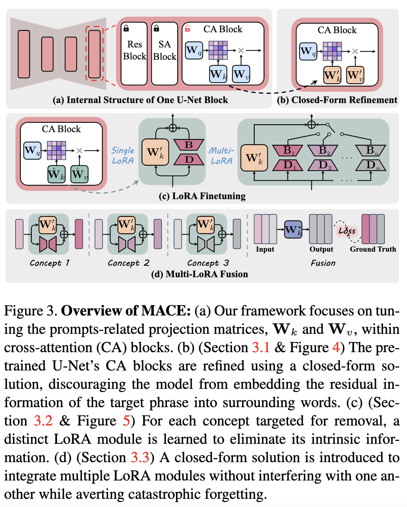


This is a series of blogs that detailed recorded the exploration of the paper [MACE: Mass Concept Erasure in Diffusion Models](https://arxiv.org/abs/2403.06135). The thumbnail image is generated by [Stable Diffusion 3.5 Large](https://huggingface.co/spaces/stabilityai/stable-diffusion-3.5-large) using the prompt "Machine Unlearning".


My current interest lies in the field of concept erasure. "MACE," an outstanding paper presented at CVPR 2024, demonstrates the capability to erase more than 100 concepts simultaneously from an image. This paper captured my interest due to its innovative approach and significant implications in the realm of image processing. In this blog, I aim to delve deeper into the intricate details of the paper and provide a comprehensive analysis alongside exploring the associated code.

Here is the paper link and its github repository:

> Paper: [MACE: Mass Concept Erasure in Diffusion Models](https://arxiv.org/abs/2403.06135)
> 

## Introduction 

Current text-to-image (T2I) generative models rely on abundant online data, which may not be adequately filtered. Even when filtered, the data can still contain offensive or biased content. For instance, despite being trained on a sanitized dataset, Stable Diffusion (SD) v2.0 has been found to produce explicit content. The motivation for concept erasure or unlearning stems from various issues, including copyright infringement, the generation of explicit content, deepfakes, and privacy breaches. While there are numerous approaches proposed, such as salient-based fine-tuning, the challenge of concept erasure primarily lies in balancing the dual requirements of generality and specificity [^p1].

- Generality: requires that a concept should be consistently removed, regardless of its expression and the context in which it appears.
- Specificity: requires that unrelated concepts remain intact.

This means that our goal is not only to remove the targeted concepts as comprehensively as possible but also to ensure that other unrelated concepts remain as intact as possible. Nevertheless, there remains ample room for improvement in this under-explored area.

MACE addresses three principal challenges:

1. **Concept Concealment**: During the process of concealing a concept, a phrase may be obscured within other words through the attention mechanism, resulting in restricted generality and incomplete erasure.
2. **Early Erasure Issue**s: Fine-tuning models during the initial denoising steps can degrade the specificity of concept erasure.
3. **Performance Decline with Massive Concept Erasure**: Erasing numerous concepts simultaneously can lead to a noticeable decline in performance, and sequential fine-tuning may result in catastrophic forgetting.

To mitigate these issues, the MACE framework introduces several innovative solutions:

1. **Closed-form Refinement of Cross-Attention Layers**: MACE begins by refining the cross-attention layers of the pretrained model using a closed-form solution. This approach prevents the embedding of residual information from the target phrase into other words, thereby effectively erasing traces of the concept.
2. **Unique LoRA Module for Each Concept**: MACE employs a distinct LoRA (Low-Rank Adaptation) module for each concept, specifically tailored to remove its intrinsic information without affecting unrelated data.
3. **Harmonious Integration of LoRA Modules**: MACE ensures that multiple LoRA modules are integrated harmoniously, allowing for simultaneous concept erasure without interfering with one another and preventing catastrophic forgetting.

## Method Overview

The MACE framework takes two inputs:

1. A pretrained model, such as Stable Diffusion v1.4
2. A set of target phrases (prompts) that expresses the concepts to be removed.

It returns a fine-tuned model that is incapable of generating images depicting the concepts targeted for erasing.

There are three criteria should be fulfill:

1. **Efficacy** (Block target phrases): fine-tuned models should produce outputs with limited semantic alignment to target phrases while maintaining natural appearance.
2. **Generality** (Block synonyms): models should block images related to synonyms of targeted phrases, ensuring erasure extends beyond exact wording.
3. **Specificity** (Preserve Unrelated Concepts): when conditioned on prompts unrelated to erased concepts, the output should closely match the original model's distribution.

Here is the overview of the MACE framework.

## Data preparation

Since MACE requires not only unlearning prompts but also the generated images and their segmentations as input, we need to prepare data for the later use of unlearning. As depicted in the README file, MACE relies on GroundingDINO and Segment Anything as essential packages to generate the intended masks. I found that configuring a specific CUDA environment is not convenient, particularly for some Docker users who cannot access CUDA support when building their Docker images. Thanks to `transformers` library, I can directly use the built-in `IDEA-Research/grounding-dino-base` for the detector and `facebook/sam-vit-huge` for segmenter. Please refer to the [pull request](https://github.com/Shilin-LU/MACE/pull/18) for more details.The code is specified in `data_preparation_transformers.py`.

In this case, it would be much easier to generate the corresponding mask instead of configuring the environment. 


**Warning!** There is an issue of warning like `Could not load the custom kernel for multi-scale deformable attention: .torch/torch_extensions/MultiScaleDeformableAttention/MultiScaleDeformableAttention.so: cannot open shared object file: No such file or directory`. However, this would not bother the generation of the mask. Please refer to the related topic here: [Huggingface Forum](https://huggingface.co/IDEA-Research/grounding-dino-base/discussions/4#67178e12d49645a28cfad0af)


In the next article, I will delve into each aspect of the method in further detail and supplement the discussion with code analysis.

[^p1]: Lu, Shilin, et al. "Mace: Mass concept erasure in diffusion models." Proceedings of the IEEE/CVF Conference on Computer Vision and Pattern Recognition. 2024.