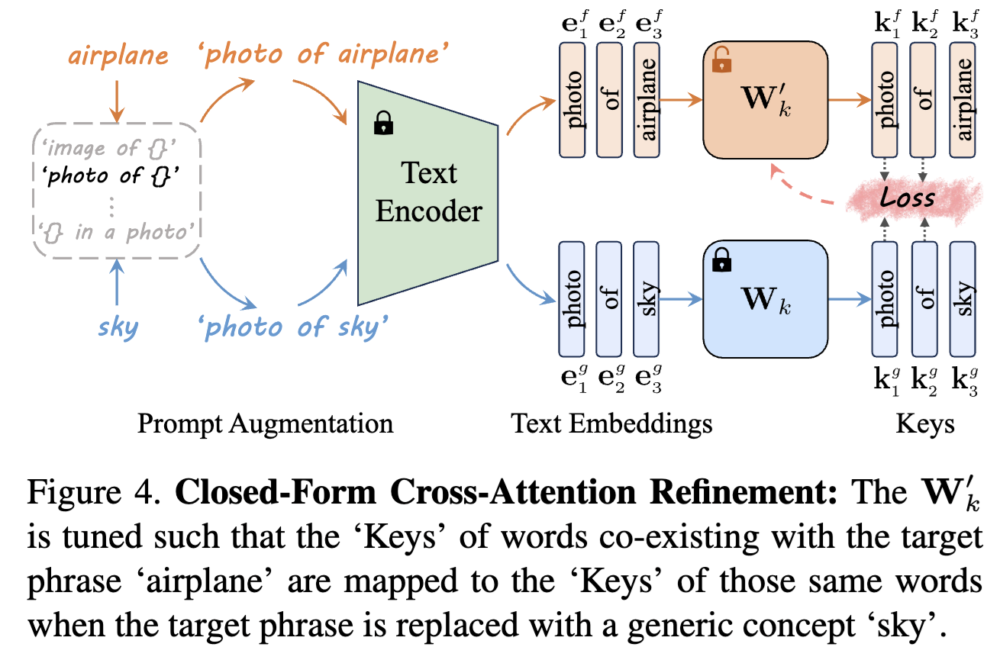


This is a series of blogs that detailed recorded the exploration of the paper [MACE: Mass Concept Erasure in Diffusion Models](https://arxiv.org/abs/2403.06135). The thumbnail image is generated by [Stable Diffusion 3.5 Large](https://huggingface.co/spaces/stabilityai/stable-diffusion-3.5-large) using the prompt "Machine Unlearning".




Here is the paper link and its github repository:

> Paper: [MACE: Mass Concept Erasure in Diffusion Models](https://arxiv.org/abs/2403.06135)
> 

## Preliminaries

### Latent Diffusion Models

A Latent Diffusion Model (LDM) is comprised of two principle component: a vector quantization autoencoder and a diffusion model. The autoencoder undergoes pretrianing to transform images into spatial latent codes via an encoder \\(z=\mathcal{E}(\mathbf{x})\\), and it can recosntruct the images from these latent coes using a decoder \\(\mathbf{x}\approx \mathcal{D}(\mathcal{E}(\mathbf{x}))\\). The diffusion model is trained to geenrate latent codes that exist within the autoencoder's latent space.

The training objective for the diffusion mdoel is defined as:

$$
\mathcal{L}_{\text{LDM}} = \mathbb{E} _{z\sim \mathcal{E}(\mathbf{x}), \mathbf{c}, \epsilon\sim\mathcal{N}(0, 1)} \left[||\epsilon-\epsilon _\theta(z_t, t, \mathbf{c})||^2_2\right]
$$

where \\(z_t\\) is the noisy latent, \\(t\\) is the timestep, \\(\epsilon\\) is a standard Gaussian noise sample, \\(\epsilon_\theta\\) is the denoising network, and \\(\mathbf{c}\\) is the conditioning embeddings.

During the inference process, Gaussian noise is sampled as a starting point \\(z_T\\) and successively denoised to produce a new latent code \\(z_0\\) through the well-trained denoising network \\(\epsilon_\theta\\).

Ultimately, the latent code is transformed into an image via the pretrained decoder \\(x_0\approx \mathcal{D}(z_0)\\).

For more details of Diffusion models and Latent Diffusion Models, please refer to a very well-written blog [Lil'Log](https://lilianweng.github.io/posts/2021-07-11-diffusion-models/).

### Cross-attention in T2I diffusion models

The cross-attention mechanism serve as the pivotal interface for the interplay between image and text modalities. Initially, a text prompt undergoes tokenization, coverting it into a series of unique token embeddings. These embeddings are then processed by a text encoder, such as CLIP [^p3], resulting in a final set of embeddings, wherein each token's embedding \\(e_i\\) is enriched with information from the entire token sequence.

The embeddings are subsequently introduced into the cross-attention modules, where they act as navigational beacons for the image synthesis process. At certain layer \\(l\\) and timestep \\(t\\), the text embeddings are mapped using projection matrices, \\(W_k\\) and \\(W_v\\) to obtain the `Keys` \\(k_{t,l}\\) and `Values` \\(v_{t,l}\\). Concurrently, the image's features \\(f_{t,l}\\) undergo the projection \\(W_q\\) to form the `Queries` \\(q_{t,l}\\). The cross-attention mechanism computes the attention map as:

$$
A_{t,l}=\text{softmax}(\frac{q_{t,l}\cdot k^\top_{t,l}}{\sqrt{d}})
$$

where \\(d\\) is the scaling factor to normalise the dot product. The module then synthesizes image features by aggregating `Values` with the attention weights \\(o_{t,l}=A_{t,l}\cdot v_{t,l}\\). This process ensures that the generated images are intricately aligned with the input text, completing the text-to-image generation with high fidelity.

For more details, please refer to detailed explained [blog](https://medium.com/@geetkal67/attention-networks-a-simple-way-to-understand-cross-attention-3b396266d82e).


## Closed-Form Cross-Attention Refinement

Lu et al. [^p1] suggest a closed-form cross-attention refinement to encourage the model to refrain from embedding residual information of the target phrase into other words. They looked into the cross-attention layer, where the text embedding of a token encapsulates information from other tokens. This results in its `Key` and `Value` vectors.

In machine unlearning, a standard way of forgetting a concept is to find an anchor concept and make the target concept move to the anchor. In MACE, when altering the projection matrix \\(W_k\\), they modify it such that the `Keys` of the words that coexist with the target phrase in the prompt are mapped to the `Keys` of those same words in another prompt, where the target phrase is replaced with either its super-category or a generic concept. The illustration here is to show how closed-form cross-attention refinement can help remove residual.



They fomulated the objective function as follows:

$$
\underset{W_{k}^{'}}{\min}\sum _{i=1}^{n}\||W_k^{'}\cdot e_i^{f}-W_k^{'}\cdot e_i^{g}||^2_2+\lambda_1\sum _{i=n+1}^{n+m}\| W_k^{'} \ \cdot e_i^{p} -W_k^{'}\cdot e_i^{p} \| _2^{2}
$$

where \\(W_k^'\\) is the pretrained weights, \\(\lambda_1 \in \mathbb{R}^+\\) is a hyperparameter, \\(e_i^f\\) is the embedding of a **word co-existing with the target phrase**, \\(e^g\\) is the embedding of that word when the target phrase is **replaced with its super-category or a generic one**, \\(e^p\\) is the embedding for **preserving the prior**, \\(n, m\\) are the number of embeddings for mapping and preserving. We can simply them as:

- \\(e^f\\): target concept embeddings.
- \\(e^g\\): anchor concept embeddings.
- \\(e^p\\): preservation embeddings.

The goal is to get a refined matrix, denoted as \\(W^'_k \in \mathbb{R}^{d_1\times d_2}\\), which encourages the model to refrain from embedding residual information, while preserving prior knowledge. To seek the optimal \\(W^'_k\\), we take the differentiation of the loss function and set the derivative equal to 0, that is:

$$
\begin{aligned}
\frac{\partial \mathcal{L}(W'_k)}{\partial W'_k}&=2\sum _{i=1}^n \left(W'_k \cdot e^f_i (e^f_i)^\top - W_k\cdot e^g_i (e^f_i)^\top\right) \\\
&+ 2 \lambda_1 \sum _{i=n+1}^{n+m} \left(W'_k\cdot e^p_i (e^p_i)^\top -W_k \cdot e^p_i(e^p_i)^\top\right) = 0 
\end{aligned}
$$

$$
\begin{aligned}
\sum _{i=1}^n W'_k \cdot e^f_i (e^f_i)^\top + \lambda_1 \sum _{i=n+1}^{n+m} W'_k\cdot e^p_i (e^p_i)^\top &= \sum _{i=1}^n W_k \cdot e^g_i (e^f_i)^\top + \lambda_1 \sum _{i=n+1}^{n+m} W_k\cdot e^p_i (e^p_i)^\top \\\
W'_k \left(\sum _{i=1}^n e^f_i (e^f_i)^\top + \lambda_1 \sum _{i=n+1}^{n+m} e^p_i (e^p_i)^\top\right) &= \sum _{i=1}^n W_k \cdot e^g_i (e^f_i)^\top + \lambda_1 \sum _{i=n+1}^{n+m} W_k\cdot e^p_i (e^p_i)^\top \\\
\end{aligned}
$$

$$
\begin{aligned}
W'_k &= \left(\sum _{i=1}^n W_k \cdot e^g_i (e^f_i)^\top + \lambda_1 \sum _{i=n+1}^{n+m} W_k\cdot e^p_i (e^p_i)^\top\right)\cdot \left(\sum _{i=1}^n e^f_i (e^f_i)^\top + \lambda_1 \sum _{i=n+1}^{n+m} e^p_i (e^p_i)^\top\right)^{-1}
\end{aligned}
$$

One big issue it to ensure the second term right-hand side invertible, which is full rank. The author exaime the following quadratic form for any non-zero vector \\(\mathbf{x}\in\mathbb{R}^{d_2}\\) that:

$$
\begin{aligned}
\mathbf{x}^\top\cdot \left(\sum _{i=1}^n e^f_i (e^f_i)^\top + \lambda_1 \sum _{i=n+1}^{n+m} e^p_i (e^p_i)^\top\right) \mathbf{x} &= \sum _{i=1}^n || \mathbf{x}^T e^f_i ||^2_2 + \lambda_1 \sum _{i=n+1}^{n+m} ||x^\top e^p_i||^2_2 \geq 0
\end{aligned}
$$

In the paper, the authour utilised the MS-COCO dataset [^p2] that has more than 60 thousand captions for prior preserving, thus makes it highly improbable for all terms \\(||x^\top e^p_i||^2_2\\) in the sum to equal zero. Hence in general case, the matrix is positive definite and thus invertible.

### Related Code

#### Caching COCO

Let's get more details to look into the code. In MACE, the author first [cache the coco captions](https://github.com/Shilin-LU/MACE/blob/main/src/cache_coco.py) as the preservation embeddings.

```python {class="my-class" id="my-codeblock" lineNos=inline tabWidth=2}
train_annotation_file = './coco2014/annotations/captions_train2014.json'
val_annotation_file = './coco2014/annotations/captions_val2014.json'

# extract_prompts: a function that extract ['caption'] from ['annotations'] 
train_prompts = extract_prompts(train_annotation_file)
val_prompts = extract_prompts(val_annotation_file)
# merge two prompt lists together
total_prompts = train_prompts + val_prompts 
```

After getting all MS-COCO captions, we first need to get all the related `to_k` and `to_v` layers that works on the interplay between text embedding and image features. Now we need to utilise the `diffusers.StableDiffusionPipeline` class to get the unet from Stable Diffusion v1.4 (we take this version for example). There is a very detailed explain of the architecture of Stable Diffusion Unet from [labml.ai](https://nn.labml.ai/diffusion/stable_diffusion/model/unet_attention.html).

```python {class="my-class" id="my-codeblock" lineNos=inline tabWidth=2}
model = "CompVis/stable-diffusion-v1-4"
final_pipe = StableDiffusionPipeline.from_pretrained(model, torch_dtype=torch.float32).to("cuda")
final_projection_matrices, final_ca_layers, final_og_matrices = get_ca_layers(final_pipe.unet, with_to_k=True)
```

Let's take a closer look at how to extract each `to_k` and `to_v` layers from `attn2` modules in the unet using [get_ca_layers](https://github.com/Shilin-LU/MACE/blob/main/src/cfr_utils.py#L33). 

```python {class="my-class" id="my-codeblock" lineNos=inline tabWidth=2}
def get_ca_layers(unet, with_to_k=True):
    # go through the whole network
    sub_nets = unet.named_children()
    ca_layers = []
    for net in sub_nets:
        # check the up layers and down layers first
        if 'up' in net[0] or 'down' in net[0]:
            for block in net[1]:
                # find the cross attention module
                if 'Cross' in block.__class__.__name__ :
                    for attn in block.attentions:
                        for transformer in attn.transformer_blocks:
                            # we only need `attn2` as it is used for text embeddings and image features
                            ca_layers.append(transformer.attn2)
        if 'mid' in net[0]:
            for attn in net[1].attentions:
                for transformer in attn.transformer_blocks:
                    # same as the `mid` layers
                    ca_layers.append(transformer.attn2)

    ## get the value and key modules
    # directly get the module, i.e., the Linear() layer
    projection_matrices = [l.to_v for l in ca_layers]
    # make a copy in case it gets overwritten
    og_matrices = [copy.deepcopy(l.to_v) for l in ca_layers]
    if with_to_k:
        # the same for `to_k`
        projection_matrices = projection_matrices + [l.to_k for l in ca_layers]
        og_matrices = og_matrices + [copy.deepcopy(l.to_k) for l in ca_layers]
    
    return projection_matrices, ca_layers, og_matrices
```

After we get the `to_k` and `to_v` modules (to calculate weights), all `ca` layers and the copy of `to_k` and `to_v` modules, we can define an empty `cache_dict` to store the embeddings, i.e., \\(e^p_i\\).

```python {class="my-class" id="my-codeblock" lineNos=inline tabWidth=2}
cache_dict = {}
for layer_num in tqdm(range(len(final_projection_matrices))):
    cache_dict[f'{layer_num}_for_mat1'] = None
    cache_dict[f'{layer_num}_for_mat2'] = None
    
# process 500 items at a time
step = 500
for i in range(0, len(total_prompts), step):
    entry = {"old": total_prompts[i:i+step], "new": total_prompts[i:i+step]}

    contexts, valuess = prepare_k_v(final_pipe.text_encoder,
                                    final_projection_matrices, 
                                    final_ca_layers, 
                                    final_og_matrices, 
                                    [entry], 
                                    final_pipe.tokenizer, 
                                    all_words=True)
    
    closed_form_refinement(final_projection_matrices, 
                           contexts, valuess, 
                           cache_dict=cache_dict, cache_mode=True)
    # delete cache to save GPU memory
    gc.collect()
    torch.cuda.empty_cache()
    
    print(f'==================== num: {i}/{len(total_prompts)}====================')
    # save parted volumes in case 
    if i % 10000 == 0:
        torch.save(cache_dict, f"./cache/coco/cache_{i}.pt")

torch.save(cache_dict, f"./cache/coco/cache_final.pt")
```

In the code above there are two very important functions we need to take care: `prepare_k_v` and `closed_form_refinement`. 

#### Prepare `to_k` and `to_v`

Let's first look at [`prepare_k_v`](https://github.com/Shilin-LU/MACE/blob/main/src/cfr_utils.py#L59) function. Since the `texts_old` and `texts_new` are identity in caching MS-COCO case (purpose for preservation), \\(e^f\\) and \\(e^g\\) in the following comments are both refer to \\(e^p\\).

```python {class="my-class" id="my-codeblock" lineNos=inline tabWidth=2}
def prepare_k_v(text_encoder, 
                projection_matrices, 
                ca_layers, 
                og_matrices, 
                test_set,
                tokenizer, 
                with_to_k=True, 
                all_words=False, 
                prepare_k_v_for_lora=False):
                
    """
    text_encoder: the text encoder from Stable Diffusion Pipeline
    projection_matrices: the temperory `to_k` and `to_v` modules
    ca_layers: the cross-attention layers
    og_matrices: the copy of `to_k` and `to_v` modules
    test_set: the prompts that needs to be processed, will be e^f and e^g later
    tokenzier: the tokenizer from Stable Diffusion Pipeline
    with_to_k: whether modify `to_k` weights
    all_words: 
    prepare_k_v_for_lora: for later lora training 
    """
    
    with torch.no_grad():
        # initialise full e^f and e^g list
        all_contexts, all_valuess = [], []
        
        for curr_item in test_set:
            gc.collect()
            torch.cuda.empty_cache()
            
            #### reinitialise LDM parameters using the backup copy
            num_ca_clip_layers = len(ca_layers)
            for idx_, l in enumerate(ca_layers):
                l.to_v = copy.deepcopy(og_matrices[idx_])
                projection_matrices[idx_] = l.to_v
                if with_to_k:
                    l.to_k = copy.deepcopy(og_matrices[num_ca_clip_layers + idx_])
                    projection_matrices[num_ca_clip_layers + idx_] = l.to_k
            
            old_embs, new_embs = [], []
            extended_old_indices, extended_new_indices = [], []
            
            #### indetify corresponding destinations for each token in old_emb
            # Bulk tokenization
            texts_old = [item[0] for item in curr_item["old"]]
            texts_new = [item[0] for item in curr_item["new"]]
            # concat two lists together to get tokenized
            texts_combined = texts_old + texts_new

            tokenized_inputs = tokenizer(
                texts_combined,
                padding="max_length",
                max_length=tokenizer.model_max_length,
                truncation=True,
                return_tensors="pt"
            )
            
            # using tokens to get text embeddings
            text_embeddings = text_encoder(tokenized_inputs.input_ids.to(text_encoder.device))[0]
            # seperate old_embeds and new_embeds 
            old_embs.extend(text_embeddings[:len(texts_old)])
            new_embs.extend(text_embeddings[len(texts_old):])

            # Find matching indices
            for old_text, new_text in zip(texts_old, texts_new):
                tokens_a = tokenizer(old_text).input_ids
                tokens_b = tokenizer(new_text).input_ids
                
                # find_mathing_indices function is to find two sequence indecies of 
                # their common and different part
                old_indices, new_indices = find_matching_indices(tokens_a, tokens_b)
                # If found difference, needs to padding to the same length
                if old_indices[-1] >= new_indices[-1]:
                    extended_old_indices.append(old_indices + list(range(old_indices[-1] + 1, 77)))
                    extended_new_indices.append(new_indices + list(range(new_indices[-1] + 1, 77 - (old_indices[-1] - new_indices[-1]))))
                else:
                    extended_new_indices.append(new_indices + list(range(new_indices[-1] + 1, 77)))
                    extended_old_indices.append(old_indices + list(range(old_indices[-1] + 1, 77 - (new_indices[-1] - old_indices[-1]))))

            #### prepare batch: for each pair of setences, old context and new values
            contexts, valuess = [], []
            if not all_words:
                # only use the differences part to save time and memory
                for idx, (old_emb, new_emb) in enumerate(zip(old_embs, new_embs)):
                    # get the e^f embedding
                    context = old_emb[extended_old_indices[idx]].detach()
                    values = []
                    for layer in projection_matrices:
                        # get the W_k * e^g embedding, !!note W_k is introduced here!!
                        values.append(layer(new_emb[extended_new_indices[idx]]).detach())
                    contexts.append(context)
                    valuess.append(values)
            
                all_contexts.append(contexts)
                all_valuess.append(valuess)
            else:
                if prepare_k_v_for_lora:
                    # prepare for lora, then no need to use new_emb
                    for idx, old_emb in enumerate(old_embs):
                        context = old_emb.detach()
                        values = []
                        for layer in projection_matrices:
                            values.append(layer(old_emb).detach())
                        contexts.append(context)
                        valuess.append(values)
                else:
                    # need to use new_emb, both common and difference part
                    for idx, (old_emb, new_emb) in enumerate(zip(old_embs, new_embs)):
                        context = old_emb.detach()
                        values = []
                        for layer in projection_matrices:
                            values.append(layer(new_emb).detach())
                        contexts.append(context)
                        valuess.append(values)
            
                all_contexts.append(contexts)
                all_valuess.append(valuess)
                
        # return e^f and e^g lists
        return all_contexts, all_valuess
```

#### Closed-form Solution

Now we got `e^p` for caching coco, we can use the derived formula above to get the closed-form solution by using the function [`closed_form_refinement`](https://github.com/Shilin-LU/MACE/blob/main/src/cfr_utils.py#L153).

```python {class="my-class" id="my-codeblock" lineNos=inline tabWidth=2}
def closed_form_refinement(projection_matrices, 
                           all_contexts=None, 
                           all_valuess=None, 
                           lamb=0.5, 
                           preserve_scale=1, 
                           cache_dict=None, 
                           cache_dict_path=None,
                           cache_mode=False):
    """
    projection_matrices: the `to_k` and `to_v` modules, 
    all_contexts: the e^f or e^p embeddings 
    all_valuess: the e^g or e^p embeddings
    lamb: the hyperparameter weight of the initialisation
    preserve_scale: the hyperparameter weight of the preservation, 
    cache_dict: the calculated weights dict
    cache_dict_path: should read pre-cached weight dict or not
    cache_mode: should cache or not
    """
    
    with torch.no_grad():
        if cache_dict_path is not None:
            cache_dict = torch.load(cache_dict_path, map_location=projection_matrices[0].weight.device)
            
        for layer_num in tqdm(range(len(projection_matrices))):
            gc.collect()
            torch.cuda.empty_cache()
            
            # the first term of the closed-formed solution, initlised with the original weights
            mat1 = lamb * projection_matrices[layer_num].weight
            # the second term of the closed-form solution, the inversed term
            mat2 = lamb * torch.eye(projection_matrices[layer_num].weight.shape[1], device=projection_matrices[layer_num].weight.device)
            
            # the container for first term and second term
            total_for_mat1 = torch.zeros_like(projection_matrices[layer_num].weight)
            total_for_mat2 = torch.zeros_like(mat2)

            if all_contexts is not None and all_valuess is not None:
                for contexts, valuess in zip(all_contexts, all_valuess):
                    # Convert contexts and values to tensors
                    contexts_tensor = torch.stack(contexts, dim=2)
                    values_tensor = torch.stack([vals[layer_num] for vals in valuess], dim=2)
                    
                    # Aggregate sums for mat1, mat2 using matrix multiplication
                    # calculate e^g \cdot e^f^top
                    for_mat1 = torch.bmm(values_tensor, contexts_tensor.permute(0, 2, 1)).sum(dim=0)
                    # calculate e^f \cdot e^f^top
                    for_mat2 = torch.bmm(contexts_tensor, contexts_tensor.permute(0, 2, 1)).sum(dim=0)
                    
                    # sum for each term
                    total_for_mat1 += for_mat1
                    total_for_mat2 += for_mat2

                del for_mat1, for_mat2
            
            # if store the weights
            if cache_mode: 
                # cache the results to save memory only
                # coco goes here
                if cache_dict[f'{layer_num}_for_mat1'] is None:
                    cache_dict[f'{layer_num}_for_mat1'] = total_for_mat1
                    cache_dict[f'{layer_num}_for_mat2'] = total_for_mat2
                else:
                    cache_dict[f'{layer_num}_for_mat1'] += total_for_mat1
                    cache_dict[f'{layer_num}_for_mat2'] += total_for_mat2
            else:
                # CFR calculation
                # add the preservation term e^p \cdot e^p^\top
                if cache_dict_path is not None or cache_dict is not None:
                    total_for_mat1 += preserve_scale * cache_dict[f'{layer_num}_for_mat1']
                    total_for_mat2 += preserve_scale * cache_dict[f'{layer_num}_for_mat2']
                    
                total_for_mat1 += mat1
                total_for_mat2 += mat2
                
                # get the final calculation
                projection_matrices[layer_num].weight.data = total_for_mat1 @ torch.inverse(total_for_mat2) 
                
            del total_for_mat1, total_for_mat2
```

For simplicity, take `closed_form_refinement(final_projection_matrices, contexts, valuess, cache_dict=cache_dict, cache_mode=True)` for example. Since we already got `final_projection_matrices`, which is the `to_k` and `to_v` modules of the cross-attention layers, `contexts` and `valuess` are the caption embeddings for coco, the `cache_dict` is empty at first, and `cache_mode` is set to `True` here. At first, it initialise the two terms to the weight of `final_projection_matrices` and an identity matrix, and then calculate \\(e^p \cdot (e^p)^{\top}\\) for both terms. Since it is in `cache_mode`, we only save the first term and second term, i.e. \\(W'_k \lambda_1 \sum _{i=n+1}^{n+m} e^p_i (e^p_i)^\top\\)  and \\(\lambda_1 \sum _{i=n+1}^{n+m} e^p_i (e^p_i)^\top\\) for later use. For unlearning part, when set `cache_mode` to `False`, it will get in the `else` branch, adding preservation term from `cache_dict` and multiplying the inverse as the formula.

In addition to retaining general prior knowledge, the MACE framework extends support to allow users to highlight the preserve `domain-specific concepts`. The only difference is to add another term of \\(W'_k \lambda_3 \sum _{i=n+m'}^{n+m} e^p_i (e^p_i)^\top\\)  and \\(\lambda_3 \sum _{i=n+m'}^{n+m} e^p_i (e^p_i)^\top\\), where \\(m'\\) is a number of terms of general knowledge and \\(m-m'\\) is a number of terms of domain-specific knowledge. This term is usually absent in most tasks, only useful in celebrity unlearning. 


[^p1]: Lu, Shilin, et al. "Mace: Mass concept erasure in diffusion models." Proceedings of the IEEE/CVF Conference on Computer Vision and Pattern Recognition. 2024.
[^p2]: Lin, Tsung-Yi, et al. "Microsoft coco: Common objects in context." Computer Vision–ECCV 2014: 13th European Conference, Zurich, Switzerland, September 6-12, 2014, Proceedings, Part V 13. Springer International Publishing, 2014.
[^p3]: Radford, Alec, et al. "Learning transferable visual models from natural language supervision." International conference on machine learning. PMLR, 2021.