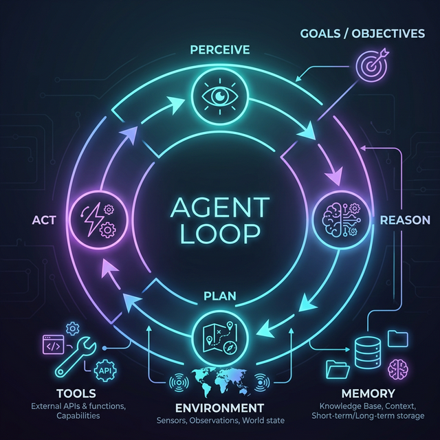
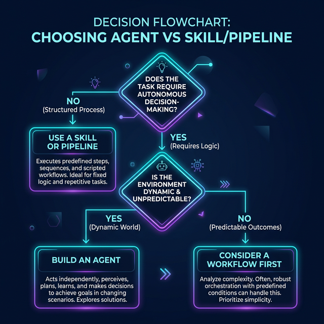


This is an opinion piece based on my observations working with AI systems and Anthropic's "Building Effective Agents" framework. I welcome healthy debate.


Everyone is building "agents" now. Open any product page, scroll through X, or browse GitHub trending — every other project bills itself as an *AI agent*. But here's the uncomfortable question I keep asking myself:

**Is your agent actually an agent, or is it just a well-dressed workflow?**

After spending months working with various AI systems — building, breaking, and rebuilding them — I've noticed a pattern. The vast majority of so-called "agents" on the market are, in reality, deterministic workflows wearing a trench coat. They follow a fixed sequence of steps: take user input → run prompt A → parse output → run prompt B → return result. 

There's no real autonomy. No genuine decision-making. No adaptation.

And honestly? That's not necessarily a bad thing. But we should stop calling them agents.

## Anthropic's Clarity: Workflows vs Agents

Before we go further, let's lean on one of the clearest frameworks available. In their influential guide [*Building Effective Agents*](https://www.anthropic.com/engineering/building-effective-agents), Anthropic draws a critical architectural distinction within what they call *agentic systems*:

> - **Workflows** are systems where LLMs and tools are orchestrated through **predefined code paths**.
> - **Agents** are systems where LLMs **dynamically direct their own processes and tool usage**, maintaining control over how they accomplish tasks.

This is a deceptively simple distinction, but it cuts right to the heart of the problem. Most products marketed as "agents" are actually workflows — and Anthropic is being refreshingly honest about that.

Anthropic goes further and identifies several workflow patterns that are commonly (and incorrectly) labeled as "agents":

| Pattern | What it does | Is it an agent? |
|---|---|---|
| **Prompt Chaining** | Sequentially connects LLM calls, output → input | ❌ No |
| **Routing** | Classifies input and sends it down a fixed path | ❌ No |
| **Parallelization** | Runs multiple LLM calls simultaneously | ❌ No |
| **Orchestrator-Workers** | One LLM breaks tasks down, workers execute | ⚠️ Getting closer |
| **Evaluator-Optimizer** | One LLM generates, another critiques in a loop | ⚠️ Getting closer |
| **True Agent** | LLM dynamically decides its own actions and tool usage in a loop | ✅ Yes |

The key insight: **if your system's execution path is determined at design time by a developer (even if an LLM fills in the blanks at each step), it's a workflow.** If the LLM *itself* decides what to do next based on what it observes, it's an agent.

In practice, a true agent operates in a **continuous feedback loop** — perceive, reason, plan, act, evaluate — where the execution path **emerges at runtime**, not from a developer-defined flowchart.



## Three Non-Negotiable Properties of a True Agent

Drawing from both Anthropic's framework and the broader research literature, I've distilled "agentness" down to three non-negotiable properties:

### 1. Autonomous Decision-Making

The system must make *meaningful* decisions about its own behavior at runtime — genuinely choosing which tool to use, deciding when to ask for clarification, or determining that it needs more information.
A workflow says "always call search, then summarize, then format." An agent says "do I even *need* to search? Are these results good enough, or should I try different terms?"

### 2. Dynamic Planning

An agent constructs and modifies its plan on the fly. It decides *which* steps to take, *in what order*, and *whether to change course* based on intermediate results. Anthropic explicitly states: agents "can be used for **open-ended problems** where it's difficult or impossible to predict the required number of steps, and where you **can't hardcode a fixed path**" [1].

### 3. Learning from Environmental Feedback

Within a task, an agent incorporates ground truth from its environment — tool call results, code execution output, API responses — to assess progress and adapt. If a search returns irrelevant results, it changes its query. If code fails, it reads the error and adjusts. This isn't just error handling; it's **reflective reasoning**.

## Enter: Skills — Modular Expertise

When Anthropic talks about **skills**, they're not using another word for "pipeline" or "workflow." Skills, as proposed in their [Agent Skills framework](https://www.anthropic.com/engineering/equipping-agents-for-the-real-world-with-agent-skills) and implemented in tools like Claude Code, are something more specific:

> **A skill is a reusable, modular package of expertise — instructions, metadata, and optional resources — that extends an agent's capabilities without modifying its core logic.**

Anthropic's own analogy is apt: who would you want filing your taxes — a math genius figuring it out from first principles, or an experienced tax professional who's filed thousands of returns? [6] Agents today are like that math genius: brilliant at reasoning, but lacking accumulated domain expertise. Skills bridge this gap.

Skills are defined in `SKILL.md` files and use **progressive disclosure** — at runtime, only the metadata (~50 tokens) is shown to the agent. If relevant, the full instructions (~500 tokens) are loaded. Supporting scripts and references (2,000+ tokens) load only on demand [6]. This means you can equip an agent with hundreds of skills without overwhelming its context window.

Skills don't replace the agent — they **augment** it. The skill provides the *what* (expert knowledge), but the agent still decides the *when* and *how*.

### Is a Skill Just a Complex Version of Tool Calling?

You might be wondering: isn't a skill just a fancier way to call tools? Not exactly. 

A **tool** is an atomic action — search the web, execute code, read a file, call an API. It does one thing, returns a result, and that's it. The agent decides *when* to use a tool, but the tool itself carries no opinion about *how* to approach a problem.

A **skill**, by contrast, is a knowledge package that shapes *how the agent thinks*. When an agent loads a `code-review` skill, it doesn't just gain access to a "lint code" tool — it absorbs an entire framework for thinking about code quality: what to look for, how to prioritize issues, when to flag security concerns vs. style nitpicks, and how to communicate findings. The skill influences the agent's *reasoning*, not just its *actions*.

Put differently: tools extend what an agent **can do**. Skills extend what an agent **knows**. A tool is a hammer; a skill is the carpentry knowledge that tells the agent when to use a hammer, when to use a screw instead, and why the joint needs reinforcing in the first place.

This distinction is critical. Here's the hierarchy:

```
┌───────────────────────────────────────────────────┐
│                     AGENT                         │
│    (Autonomous reasoning, planning, routing)      │
│                                                   │
│  Skills (knowledge):                              │
│  ┌─────────────┐ ┌──────────┐ ┌──────────┐        │
│  │  Technical  │ │   Code   │ │  Content │        │
│  │   Writer    │ │  Review  │ │  Creator │        │ 
│  └─────────────┘ └──────────┘ └──────────┘        │
│                                                   │
│  Tools (actions):                                 │
│  ┌────────┐ ┌──────────┐ ┌─────────┐ ┌───────┐    │
│  │ Search │ │ Code Exec│ │ File IO │ │  API  │    │
│  └────────┘ └──────────┘ └─────────┘ └───────┘    │
│                                                   │
│  Skills shape HOW the agent thinks.               │
│  Tools define WHAT the agent can do.              │
│  The agent decides WHEN and WHY to use each.      │
└───────────────────────────────────────────────────┘
```

In my own project, I have skills like `technical-writer`, `fact-checker`, and `content-creator` — each packaged as a `SKILL.md` with instructions and resources. When I ask the agent to write a blog post, it *loads* the relevant skills and *then* autonomously decides how to apply them. The skills don't dictate the execution path — the agent does.


## When Should You Build a Skill Instead of an Agent?

Here's my practical decision framework:



**Package it as a skill when:**

- You have **domain expertise** that can be codified into instructions
- The knowledge is **reusable** across different tasks and contexts
- You want to **augment** an existing agent without rebuilding it
- The expertise involves **how to think about a problem**, not just what steps to follow
- You want **composability** — the ability to mix and match expertise

**Build a workflow when:**

- The task has a **well-defined, fixed sequence** of steps
- **Predictability and consistency** matter more than flexibility
- You need **auditability** — you must explain exactly what the system did
- The **cost of failure** is high — financial transactions, compliance checks
- **Latency matters** — workflows skip the reasoning overhead of agent loops

**Build an agent when:**

- The task is **genuinely open-ended** — there's no single right sequence of steps
- The system needs to **recover gracefully from unexpected failures**
- **Multi-step reasoning** with dynamic branching is essential
- The system needs to **use judgment** about which tools and skills to apply
- You want the system to **adapt its strategy** based on intermediate results

## So What Should You Actually Build?

Skills and agents aren't alternatives — they're complementary. A skill alone does nothing; it's expertise sitting in a folder. An agent without skills is a generalist — capable but shallow. The real question is: **"Do I need an agent, or is a workflow enough?"**

Anthropic's answer: start simple.

> "Success in the LLM space isn't about building the most sophisticated system. It's about building **the right system** for your needs. Start with simple prompts, optimize them with comprehensive evaluation, and add multi-step agentic systems **only when simpler solutions fall short**." — Anthropic [1]

Before you call your next project an "agent," run through this checklist:

1. Does it make *real* decisions at runtime, or does it follow a predefined path?
2. Can it *change its plan* based on what it observes?
3. Does it *reason about failure*, or does it just retry?
4. Does the LLM *control* the execution flow, or does your code?

If you answered "no" to any of these — you've built a **workflow**. And that's perfectly fine. Workflows are the workhorses of production AI — more reliable, cheaper, faster, and easier to debug than agents. Anthropic's own data shows that multi-agent implementations typically use **3-10x more tokens** than single-agent approaches for equivalent tasks [8].

And if you have domain expertise to share? Package it as a **skill**. Make it modular, reusable, and composable. Skills are expertise as infrastructure — arguably the most practical contribution you can make to the AI ecosystem.

Build workflows. Package skills. And when you genuinely need autonomous reasoning, *then* build an agent — equipped with your battle-tested skills.

---

## References

[1] Anthropic. "Building Effective Agents." *Anthropic Engineering*, December 2024. [Link](https://www.anthropic.com/engineering/building-effective-agents)

[2] Google Cloud. "What are AI Agents?" *Google Cloud AI Documentation*, 2024. [Link](https://cloud.google.com/discover/what-are-ai-agents)

[3] McKinsey & Company. "What are AI Agents?" *McKinsey Digital*, 2024. [Link](https://www.mckinsey.com/featured-insights/mckinsey-explainers/what-are-ai-agents)

[4] Stuart Russell and Peter Norvig. *Artificial Intelligence: A Modern Approach*. 4th Edition, Pearson, 2020.

[5] Andrew Ng. "Agentic Design Patterns in AI." *The Batch, DeepLearning.AI*, 2024.

[6] Anthropic. "Building Agents with Skills: Equipping Agents for Specialized Work." *Claude Blog*, 2025. [Link](https://claude.com/blog/building-agents-with-skills-equipping-agents-for-specialized-work)

[7] Anthropic. "Anthropic Agent Skills." *Claude Documentation*, 2025. [Link](https://docs.anthropic.com/en/docs/agents-and-tools/agent-skills)

[8] Anthropic. "Building Multi-Agent Systems: When and How to Use Them." *Claude Blog*, 2025. [Link](https://claude.com/blog/building-multi-agent-systems-when-and-how-to-use-them)
